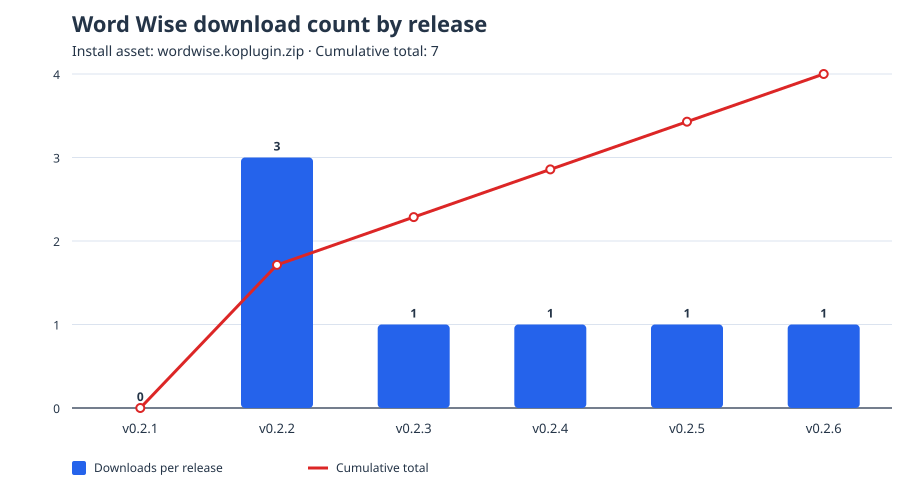

# Word Wise for KOReader

<p align="center">
  
</p>

<p align="center">
  <strong>CEFR vocabulary hints for KOReader, optimized for Android.</strong><br>
  Show short definitions above difficult words without modifying the book.
</p>

<p align="center">
  <a href="https://github.com/trigon1998/wordwise.koplugin/releases/latest"></a>
  <a href="https://github.com/trigon1998/wordwise.koplugin/releases"></a>
  <a href="https://github.com/trigon1998/wordwise.koplugin/actions/workflows/update-download-stats.yml"></a>
</p>

Word Wise is an Android-focused fork of [`asxelot/wordwise.koplugin`](https://github.com/asxelot/wordwise.koplugin) for [KOReader](https://github.com/koreader/koreader). It displays CEFR-tagged definitions, supports multiple senses per word, stores user choices outside the plugin directory, and provides OTA updates through GitHub Releases.

> **Supported documents:** reflowable/crengine documents. PDF, fixed-layout documents, Kindle conversion, and Amazon corpus features are not supported.

## Features

| Feature | Description |
| --- | --- |
| **CEFR filtering** | Filter hints using `A1`, `A2`, `B1`, `B2`, `C1`, or `C2` thresholds. |
| **Multiple senses** | Choose the definition that best matches the context of the word. |
| **Paginated popup** | Browse alternative senses by page instead of using a full scrolling list. |
| **Fixed actions** | **Know/Show**, **Dictionary**, and **Cancel** remain visible in a horizontal footer. |
| **Mixed typography** | CEFR is bold, POS is italic in parentheses, and the definition uses regular text. |
| **Persistent state** | Known words and selected senses survive plugin updates. |
| **GitHub OTA updates** | Check and install validated releases from inside KOReader. |
| **Android performance** | Bounded lookup cache, coalesced refreshes, lifecycle guards, and popup widget cleanup. |

## Installation

<details><summary><strong>Install manually</strong></summary>

1. Download `wordwise.koplugin.zip` from the [latest release](https://github.com/trigon1998/wordwise.koplugin/releases/latest).
2. Extract it as a folder named `wordwise.koplugin`.
3. Copy the folder to the KOReader plugins directory, normally `koreader/plugins/`.
4. Restart KOReader.
5. Open a reflowable book and select **Menu → More tools → Word Wise → Show inline hints**.

</details>

<details><summary><strong>Update through OTA</strong></summary>

Open the Word Wise menu in KOReader and select **Check for updates**. Confirm the update when a newer GitHub Release is available, then restart KOReader after installation.

The updater expects these release assets:

```text
wordwise.koplugin.zip
wordwise.koplugin.zip.sha256
```

User data is stored outside the plugin directory and is preserved during updates.

</details>

## Usage

### CEFR threshold

Select **CEFR threshold** from the Word Wise settings. A threshold includes that level and all higher levels. For example, `B2` includes `B2`, `C1`, and `C2`.

### Select a sense

Tap an inline hint to open the sense popup. The currently displayed sense appears in the header and is not repeated in the alternatives list. Use **Previous** and **Next** to browse pages, then tap a sense to save it for the lemma.

Each alternative row has the same height. The row format is:

```text
A1 (noun): regular definition
```

### Know, Show, and Dictionary

Select **Know** to hide all senses and occurrences associated with the lemma. Select **Show** to restore the lemma. Select **Dictionary** to open KOReader's standard dictionary for the current word. Select **Cancel** or press Back to close the popup.

## User data

Word Wise keeps user state in the KOReader data directory:

```text
<KOReader data directory>/wordwise/known_words.lua
<KOReader data directory>/wordwise/state.lua
```

A user dictionary can be placed at:

```text
<KOReader data directory>/wordwise/wordwise.db
```

The user dictionary takes precedence over the bundled dictionary. The **Known words file** menu item displays the actual data path on the device.

## Dictionary data

The bundled database contains one row per sense:

```sql
CREATE TABLE entries (
    id         INTEGER PRIMARY KEY,
    word       TEXT NOT NULL COLLATE NOCASE,
    short_def  TEXT NOT NULL,
    cefr_level TEXT NOT NULL CHECK(cefr_level IN ('A1','A2','B1','B2','C1','C2')),
    pos        TEXT,
    sense_key  TEXT NOT NULL UNIQUE,
    source     TEXT
);
```

The build pipeline combines CEFR-J, Octanove C1/C2, curated glosses, and Open English WordNet. Kindle/Amazon data is not part of this fork.

## Development

The project is a Lua/LuaJIT KOReader plugin. The main modules are:

| File | Responsibility |
| --- | --- |
| `main.lua` | Plugin lifecycle, menu, page overlay, touch handling, and user state |
| `wordwise_db.lua` | SQLite lookup, CEFR filtering, de-inflection, and cache |
| `wordwise_hint_dialog.lua` | Paginated sense popup and fixed action footer |
| `wordwise_l10n.lua` | Plugin-specific translations |
| `wordwise_ota.lua` | GitHub Release checking and installation |
| `tools/build_cefr_wordnet_dict.py` | CEFR and WordNet database builder |
| `tools/update_download_chart.py` | Release download statistics generator |
| `tests/test_cefr.py` | Database and static regression tests |

Build the dictionary with:

```sh
cd tools
python3 build_cefr_wordnet_dict.py \
  --cefrj cefrj-vocabulary-profile-1.5.csv \
  --octanove octanove-vocabulary-profile-c1c2-1.0.csv \
  --glosses open_glosses.tsv \
  --out ../wordwise.db
```

Run the validation suite from the repository root:

```sh
python3 /home/ubuntu/check_lua_syntax.py
python3 tests/test_cefr.py
python3 -m py_compile tools/*.py
```

See [`DEVELOPMENT.md`](DEVELOPMENT.md) for architecture details, database rules, lifecycle and memory-safety requirements, OTA validation, release packaging, troubleshooting, and Android test procedures.

## Android testing

Static checks do not replace device testing. Before release, test a large reflowable book on KOReader Android and verify hint placement, long-definition truncation, collision handling, multi-page sense selection, fixed footer visibility, Know/Show, Dictionary, Cancel, Back, outside-tap behavior, state persistence, OTA installation, and repeated page navigation.

## Contributing

When reporting an issue or opening a pull request, include the KOReader version, Android device, book format, CEFR threshold, number of senses, and reproduction steps. Update regression tests and `DEVELOPMENT.md` when changing the database schema, popup behavior, lifecycle, or OTA contract.

## Download statistics

<p align="center">
  
</p>

[Latest release]: https://github.com/trigon1998/wordwise.koplugin/releases/latest
