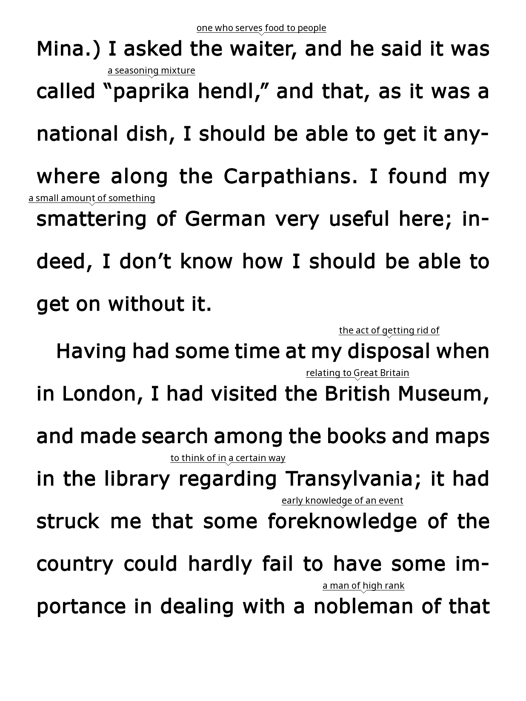

# Word Wise for KOReader — Android CEFR fork

This fork is based on [asxelot/wordwise.koplugin](https://github.com/asxelot/wordwise.koplugin) and is optimized for **KOReader on Android**. It shows short definitions above difficult words as a per-page overlay without rewriting the book file.

The fork removes Kindle/Amazon corpus detection and conversion. Its bundled data is built from the open CEFR-J and Octanove vocabulary profiles plus Open English WordNet definitions. The project keeps upstream attribution and records the data sources used by the build tools.



## Install on Android

1. Download the release ZIP and unzip it as `wordwise.koplugin`.
2. Copy the folder to the KOReader plugins directory, normally `koreader/plugins/`.
3. Restart KOReader.
4. Open a reflowable book and select **☰ → More tools → Word Wise → Show inline hints**.

The plugin targets reflowable/crengine documents. Paging/fixed-layout documents are not currently supported because the overlay needs KOReader’s visible-word and screen-box APIs.

## CEFR filtering

The menu uses a **CEFR threshold** rather than the upstream 1–5 difficulty scale. A selected threshold shows hints at that level and above. For example, choosing `B2` permits `B2`, `C1`, and `C2` entries while hiding `A1`–`B1` entries.

CEFR levels are stored as `A1`, `A2`, `B1`, `B2`, `C1`, or `C2`. Unknown or malformed levels are ignored when building the database, rather than being silently assigned a level.

## Multiple hints and context selection

A word can have multiple senses. The database stores each sense as a separate row with a stable `sense_key`, part of speech, CEFR level, and source. The first eligible sense is shown by default.

Inline hints are bounded to a compact width. When a definition is wider than that limit, the inline rendering uses a single ellipsis glyph (`…`) instead of spilling across the page; tapping the hint opens the full definition and the available senses. If an above-word hint would cross the top safe inset, the complete hint unit is placed below the word with an upward-pointing marker.

Tap a visible hint to open the Word Wise action dialog. The sense rows are left-aligned and show the CEFR/POS classification in a compact bold row. The three action controls are placed in one horizontal row to reduce popup height. Selecting a sense saves it for that lemma and repaints the current page so the preferred gloss is shown on future occurrences.

The action row provides **Know** or **Show**, **Dictionary**, and **Cancel**. **Know/Show** suppresses or restores the entire lemma: pressing **Know** hides every sense and every inflected occurrence of that word. **Dictionary** invokes KOReader’s standard dictionary lookup for the underlying word. A tap outside a hint is deliberately not consumed, so Android page-turn gestures continue to work normally.

## Database schema

The fork reads this schema:

```sql
CREATE TABLE entries (
    id         INTEGER PRIMARY KEY,
    word       TEXT NOT NULL COLLATE NOCASE,
    short_def  TEXT NOT NULL,
    cefr_level TEXT NOT NULL CHECK(cefr_level IN ('A1','A2','B1','B2','C1','C2')),
    pos        TEXT,
    sense_key  TEXT NOT NULL UNIQUE,
    source     TEXT
);

CREATE INDEX entries_word_idx ON entries(word COLLATE NOCASE);
CREATE INDEX entries_cefr_idx ON entries(cefr_level);
```

A user database placed at `<koreader data dir>/wordwise/wordwise.db` overrides the bundled database. User choices are stored separately in `<koreader data dir>/wordwise/known_words.lua` and `<koreader data dir>/wordwise/state.lua`, outside the plugin folder. Updating or replacing `wordwise.koplugin` therefore does not remove the known-word list. The Word Wise menu includes **Known words file** to show the exact path. The runtime also accepts the upstream `difficulty` schema as a temporary compatibility path and maps its five bands approximately to CEFR.

## Building the dictionary

The preferred build uses the open CEFR-J and Octanove profiles together with Open English WordNet:

```sh
cd tools
python3 build_cefr_wordnet_dict.py \
  --cefrj cefrj-vocabulary-profile-1.5.csv \
  --octanove octanove-vocabulary-profile-c1c2-1.0.csv \
  --glosses open_glosses.tsv \
  --out ../wordwise.db
```

The builder preserves curated rows from `open_glosses.tsv`, adds multiple WordNet senses for CEFR-mapped lemmas, and never invents a CEFR level. Gloss rows without an audited CEFR mapping are reported and skipped.

To build only from curated glosses, use `build_cefr_dict.py`. The removed upstream Zipf difficulty pipeline is intentionally not part of this fork’s release build.

## Data and attribution

The bundled dictionary uses:

- CEFR-J Vocabulary Profile 1.5, provided by the CEFR-J project and Tono Laboratory at Tokyo University of Foreign Studies.
- Octanove Vocabulary Profile C1/C2 1.0, used under its stated CC BY-SA 4.0 terms.
- Open English WordNet 2024 definitions.
- Project-curated glosses in `tools/open_glosses.tsv`.

Review the upstream repository’s licensing status before publishing a redistributed fork. The upstream repository does not expose a recognized GitHub license, so attribution and permission should be clarified with the original author before distributing modified upstream code or assets.

## Compatibility and stability notes

The CEFR migration does not alter the page traversal, overlay painting, reflow hooks, line-spacing adjustment, or screen-box anchoring. Those are the stability-critical parts of the plugin. The migration changes database lookup and menu filtering only.

The main Android-specific risk is interaction: the hint tap zone is full-screen for priority purposes but consumes a gesture only when its coordinate intersects a rendered hint or its compact text box. This follows KOReader’s existing highlight interaction pattern and avoids stealing ordinary page turns. Layout checks the top and bottom safe insets before painting, truncates by measured glyph width rather than character count, and searches available horizontal gaps before dropping a colliding hint.
